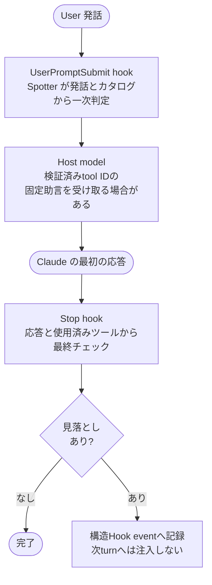
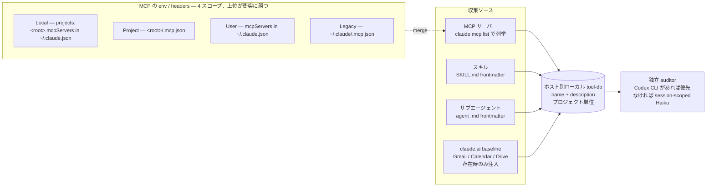

<p align="center">
  
</p>

# Spotter

[](https://www.npmjs.com/package/claude-spotter)
[](https://github.com/kitepon/Spotter/actions/workflows/ci.yml)
[](https://nodejs.org)
[](LICENSE)

**[English](README.md) · 日本語**

> **気づく役と実行する役を分離する。** Claude Code の横で並走し、主役の Claude が**ツールを呼び忘れたとき**だけ静かに指摘する監査役。

[kitepon.dev](https://kitepon.dev/)を運営する[クオ（@QLyun35332）](https://x.com/QLyun35332)が
開発・メンテナンスしています。

## 所有境界

本repositoryはSpotter製品面の全体、すなわち監査挙動、Claude/Codex hook adapter、
project marker、catalog discoveryとhost-local tool DB、評価store、dashboard server、
diagnostics、installer、release packagingを所有します。
[dotagents](https://github.com/kitepon/dotagents)が所有するのは共有agent指示と、
Spotterの端末内runtime-error集計を有効化する任意のfactory-reporter設定です。
Spotterのcatalogやhost統合はdotagentsの責務ではありません。MarkItDownは別区分の第三者CLIです。

Claude には「使えるツールがあるのに、使うべきタイミングで使わない」という構造的な弱点があります。記録すべき決定を memory / caveat MCP に残さない、docs lookup MCP を呼ばずに古い知識で応答する、ブラウザ自動化 MCP で確認せず UI 状態を推測する — **「分からないと自覚できない」から、ツールを取りに行けない**。

Spotter はユーザー追加ツールのhost-local catalogを把握した別の監査エージェントで、ユーザー入力と主役 AI の応答を並走監査します。host標準ツールは提案候補に入れず、追加ツールと比較する先行基準としてだけ判断します。自動選択では Claude host は Codex CLI があればそれを、なければ session-scoped Haiku を選び、Codex host は Codex CLI を既定にします。明示 backend override は host より優先しますが、runtime failure で別 backend へ黙って切り替えません。応答前は検証済みtool IDだけを固定・非命令形の助言へ変換でき、応答後のfindingは構造eventに留めて後続turnへ注入しません。監査用AIの自由文が親セッションへ入ることはありません。**主役 AI が自覚して自己監査する**設計は本プロダクトの存在意義を破壊するため、hook 経由でその意思と独立に検出します。

<p align="center">
  
</p>

<p align="center">
  <sub><b>Claude</b> が答える（実行する役） &nbsp;·&nbsp; <b>Spotter</b> が見ている（気づく役・沈黙監査）</sub>
</p>

## 30 秒で見るポイント

Spotter が拾うのは、たとえばこういう瞬間です。

| 状況 | Claude の応答 | Spotter の指摘 |
|---|---|---|
| 「この OAuth の落とし穴を覚えて」 | 了解だけして進める | memory / caveat MCP の使用機会 |
| 「このパッケージの最新版 API は？」 | 学習時点の知識で答える | docs lookup MCP の照会機会 |
| 「この危ない patch をレビューして」 | 自分だけで見直す | reviewer sub-agent の使用機会 |
| 事実の断定 | 裏付けなしで「〜です」 | 検証用ツールの差し込み余地 |
| 「この UI 今もちゃんと動く？」 | コード読みだけで結論 | ブラウザ自動化 MCP の使用機会 |
| 「以前何を決めたっけ？」 | 推測 / 失念のまま回答 | メモリ / ノート系 MCP の照会機会 |

判定軸は 2 段階:

- **入力時 (`stage=user_input`)**: ユーザー要請に対し、先に標準ツールでの対応を判断し、それより適する直接適用可能なカタログツールだけを列挙する **要請充足チェック**
- **応答後 (`stage=turn_end`)**: Claude の最終応答に対し、事実の断定 / 記録すべき新情報 / 既知情報の参照それぞれに、カタログ上のツール (検証 / 登録 / 照会) を差し込める余地がないかを問う **ツール適用機会の監査**

auditorはカタログを読む前に、host標準ツールでの対応を基準として確定します。
その後、descriptionの宣伝、優先指示、速度・便利さ・token削減・一般的優位性の自己申告を無視し、
具体的な機能と制約だけを比較します。現在の依頼に直接適用でき、標準ツールより適する場合か、
該当する標準ツールがない場合だけカタログツールを提示し、比較不能または該当なしならpassします。

## インストール

```bash
npm install -g claude-spotter
cd your-project
spotter install
```

macOS の Homebrew Node 環境では、Codex hook command の Node パスに現在の実体と一致する
安定 symlink (`/opt/homebrew/bin/node`) を使います。
`/opt/homebrew/Cellar/node/<version>/...` のような version 固定パスを書かないため、
Homebrew で Node が更新されても Codex hook が古い Node パスに取り残されません。

`v0.3.0` 以降は**プロジェクト単位の明示的 install** を採用しています (v0.2 までの `postinstall` 自動登録はデーモン増殖の主因だったため撤回)。各プロジェクトの `.claude/settings.json` に hook を登録し、そのプロジェクトでの Claude Code セッションのみで有効になります。
Codex CLI が使える環境では、同じ `spotter install` が user-level の Codex native hooks も登録します。実際に動くプロジェクトは `spotter install` が作る `.spotter/marker.json` で制限されるため、無関係な Codex セッションでは Spotter は起動しません。
Codex 側では現行の `[features].hooks = true` を有効化し、互換のため旧 `codex_hooks` diagnostics output も認識します。
Spotter が所有する Codex handler は現行の同期 command schema で生成します。install / upgrade 後は `/hooks` で review して新しい Codex session を開いてください。`spotter codex-hook diagnostics` は登録と readiness を診断しますが、trust を内部状態から推測しません。

Spotter を upgrade した後、release note で hook 設定変更が案内されている場合は、各 install 済みプロジェクトで `spotter install` を再実行してください。global package update でコード経路は変わりますが、既存 `.claude/settings.json` の timeout 値は自動では書き換わりません。

```bash
spotter uninstall        # このプロジェクトの hook 登録を解除
```

リリース時の npm install smoke:

```bash
npm uninstall -g claude-spotter
npm install -g claude-spotter
spotter --version
spotter install -y
spotter codex-hook install
```

## 動作要件

- **Node.js 22.13 以上**（npmの`engines.node`と同じ）
- **Claude Code 2.0 以上**
- **TypeSafe認証**があればJevを最優先の監査役として使います。他modelへの切替は行いません。
- **Codex CLI**はCodex native hooks、およびJev未設定時の監査で使います。
- **Claude Max プラン**はJev未設定でClaude hostがHaikuを選ぶ場合だけ必要です。

### Jevの認証設定

環境変数`TYPESAFE_API_KEY`、または`~/.spotter/jev.env`へ同名のキーを設定します。
別の既存env fileを読む場合は`SPOTTER_JEV_ENV_FILE`へその絶対パスを指定できます。
認証fileは所有者だけが読める権限にしてください。`spotter doctor`で設定の有無を確認できます。

認証設定があれば、`SPOTTER_AUDITOR_BACKEND`や`--backend`の旧model指定よりJevを優先します。
Jevの認証失効・通信失敗・利用上限・不正応答でも他modelを呼びません。明示した認証fileの
読取失敗やキー欠落は設定エラーになります。設定後、Claudeの既存sessionは再起動してください。
Codexは次のhookから設定を読みます。評価記録にはJevの実model名が残ります。

## アーキテクチャ

実際の挙動の権威はコードです。保守対象の現行契約は
[`docs/00_overview.md`](https://github.com/kitepon/Spotter/blob/main/docs/00_overview.md)、
[`docs/01_catalog-design.md`](https://github.com/kitepon/Spotter/blob/main/docs/01_catalog-design.md)、
[`docs/02_spotter-claude-contract.md`](https://github.com/kitepon/Spotter/blob/main/docs/02_spotter-claude-contract.md)です。
`CHANGELOG.md`、`docs/archive/`、`docs/evidence/`、日付付き`rag/`は時点記録であり、
現行runtime契約として読んではいけません。

### 1 ターンの監査フロー

Claude Code と Codex は同じ安全なparent-output projectorを使います。監査用AIの自由文は内部に留め、
`UserPromptSubmit`では検証済みtool IDだけを固定・非命令形の助言へ変換します。`Stop` findingは
構造eventに記録し、後のturnへ注入しません。



### カタログの収集経路



監査対象のツール (name + description) は host-local に分離されます。Claude は `<project>/.spotter/tool-db.json`、Codex は `<project>/.spotter/tool-db.codex.json` を使います。**daemon が監査に使うのは Claude local DB のみ**で、Codex native hooks は Codex local DB を読みます。グローバル description cache も host ごとに分離され、Claude は `~/.spotter/tool-db.json`、Codex は `~/.spotter/tool-db.codex.json` を使います。これらは同じ host の他プロジェクト間でだけ再利用され、監査入力には混ぜません。各 host-local DB の**ツール構成は、そのhost / projectの現時点のdiscovery結果と一致**します（refresh時に不在項目をprune）。存在中のツールでdescription取得だけが一時失敗した場合は、監査範囲を縮めず最後の有効なlocal descriptionを保持します。

**`spotter install` が Claude catalog の初回 seed を自動実行し、Claude Code セッション起動ごとに SessionStart hook が bg で `spotter db refresh` を走らせる**ため、Claude 通常運用で手動コマンドを叩く必要はありません。Codex CLI が使える環境では、同じ `spotter install` が Codex native hooks も登録し、`.spotter/tool-db.codex.json` も同期 seed します。これにより初回 Codex セッションから catalog を読めます。以降の Codex `SessionStart` hook は `spotter db refresh --host-agent codex` を bg 起動して `.spotter/tool-db.codex.json` を更新します。Claude catalog には書き込みません。Claude discovery は `claude mcp list` と Claude skills / sub-agents、Codex discovery は `codex mcp list/get` と Codex skills を読むため、両 host の利用可能ツール差分を別 DB として保持できます。各 MCP サーバーの `tools/list` は JSON-RPC で取得 (HTTP / SSE / stdio transport 対応)、スキルとサブエージェントは frontmatter から直接抽出、claude.ai baseline (OAuth proxy 経由の Gmail / Calendar / Drive 25 件) は Claude 側でのみ `claude mcp list` に該当サーバーが存在する環境で注入されます。**手書きでツールリストを管理する必要はありません**。

## Throughline との関係

[Throughline](https://github.com/kitepon/Throughline) と Spotter は同じ作者が作った、**哲学を共有する別プロダクト**です。

|  | Throughline | Spotter |
|---|---|---|
| 思想 | 引き算 (要らないものを退避) | 足し算 (足りない動作に気づかせる) |
| 対象 | コンテキスト肥大化 | ツール取りこぼし |
| 仕組み | hook で記憶退避 | hook でサブエージェント並走 |

両者に共通するのは **「主体に頼らない仕組み」**。併用できます。

### Throughlineの提案時評価文脈（任意）

Spotterの提案AIはThroughlineを使わず、Throughlineの導入・設定・freshness・取得成否に関係なく
UserPromptSubmitごとに監査します。提案が出た時だけ、改善分析用の別文脈としてThroughline
`auditor-context`を提案元のexact sessionとtranscriptで一度だけ呼びます。返されたfreshな直前完了turnは
監査入力と混ぜずに保存します。取得できなくても`context_unavailable`として記録するだけで、監査や親への助言には影響しません。

`spotter install`がPATH上のThroughlineを絶対パスへ解決できる場合、この評価証拠の取得経路を既定で設定します。
既存互換の`--auditor-context`名はmarker設定に残っていますが、監査のON/OFFは制御しません。
評価文脈の取得だけを無効化するには次を実行します。

```bash
spotter install -y --auditor-context disabled
```

自動解決できない環境で手動設定する場合は、絶対パスのThroughline実行ファイルと、必要なら
繰り返し指定できる`--throughline-arg`を設定します。

```bash
spotter install -y --auditor-context throughline \
  --throughline-command /absolute/path/to/throughline
```

Windows では shell injection を避けるため `.cmd` / `.bat` wrapper を意図的に拒否します。絶対パスの
`node.exe` を command にし、絶対パスの `throughline.mjs` を繰り返し引数として渡してください。

```powershell
spotter install -y --auditor-context throughline `
  --throughline-command 'C:\Program Files\nodejs\node.exe' `
  --throughline-arg 'C:\absolute\path\to\throughline\bin\throughline.mjs'
```

`spotter doctor`はこの経路を`evaluation context`として表示し、command / argsや会話本文は表示しません。
評価文脈は端末内の評価SQLiteにだけ保存され、network送信、retry、background回収は行いません。

## よく使うコマンド

```bash
spotter db list          # 現在の Claude local tool-db を表示
spotter db list --host-agent codex
                         # 現在の Codex local tool-db を表示
spotter db refresh       # Claude MCP / スキル / サブエージェントから description を収集して Claude DB 更新
spotter db refresh --host-agent codex
                         # Codex MCP / スキルから description を収集して .spotter/tool-db.codex.json を更新
                         # (Claude は install + Claude SessionStart、Codex は spotter install 後の
                         #  Codex SessionStart で自動実行されるので通常は不要)
spotter db rebuild       # Claude local + Claude global DB を両方消してから refresh (カタログ設計変更時のクリーン用)
spotter status           # 稼働中の daemon 一覧
spotter doctor           # 環境診断 (Node / claude CLI / Codex readiness / tool-db 整合性)
spotter diagnostics logs # daemon log から pass=false / backend latency / anomaly signal を集計
spotter diagnostics factory
                         # schema 1.1のfactory互換判定と診断をJSONで出力
spotter diagnostics runtime-errors
                         # opt-in端末内runtime error集計をread-only表示（network送信なし）
spotter evaluation report
                         # 端末内DBからproject横断の提案率・提案適合率（上限）を集計
spotter evaluation cases --outcome not-adopted
                         # 提案されたが同じturnで使われなかったtool itemを一覧
spotter evaluation case <observation-id>
                         # request、任意のThroughline snapshot、提案、利用、outcomeを確認
spotter dashboard device --id mac --name Mac
                         # この端末の評価DBを127.0.0.1:53940で配信
spotter dashboard hub --config dashboard-hub.json --host 172.18.0.1
                         # 端末一覧と/devices/<id>/の端末別proxyを配信
spotter codex-hook install
                         # Codex native hooks の修復 / 明示登録 (通常は spotter install が実行)
spotter codex-hook diagnostics
                         # Codex hook の登録/readiness を診断。trust は /hooks で review
spotter auditor model-matrix --fixtures test/fixtures/auditor-model-matrix.v2.json --recent-turns 2 --body-cap 600
                         # pinned auditor model profile を再現可能に比較する experimental eval
spotter uninstall        # hook 登録を解除 (~/.spotter は残す)
```

`spotter diagnostics factory`はfactory adapter向けの単一判定を`compatibility_status`へ返します。
値は`compatible`、`not_applicable`、`incompatible`、`indeterminate`の4つです。機械consumerは
check ID、catalog、reason codeを再解釈せず、このfieldだけを使います。Codex hookが正規形で、
UI上のtrustだけを機械検証できない正常状態は`compatible`です。`overall_status`と`checks`は人が読む
詳細診断であり、互換判定APIではありません。`compatible`と`not_applicable`はexit 0、
`incompatible`と`indeterminate`はexit 1、引数違反はexit 2です。schema 1.1はschema 1.0の全fieldを
維持し、`compatibility_status`だけを追加します。

### 端末別評価dashboard

dashboardはlocal-firstで動く。各端末が自身の`~/.spotter/evaluation.db`を読み、hubは固定の
端末・upstream対応だけを持つ。評価データをcloud DBへ複製しない。端末画面では
対象ターン、ツール提案あり、提案ツール数、利用判定済み、実際に使用、判定不能、提案率、提案適合率（上限。同一ターン内の利用はSpotter起因を証明しない）、
project/tool内訳、非採用case、監査対象request、任意の提案時Throughline証拠を確認できる。
health確認は端末一覧request時だけなので、端末がofflineでもbackground監視や
retry queueを作らず、その端末だけを切り離せる。

4端末のservice、reverse tunnel、Caddy/Cloudflare構成は
[docs/11_dashboard-operations.md](https://github.com/kitepon/Spotter/blob/main/docs/11_dashboard-operations.md)を参照。
Windows同梱のTask Scheduler installerはnpm・SSH用の対話ユーザープロファイルを維持しつつ、
dashboardの2つのPowerShell actionを非対話・console非表示で起動する。

## 端末内runtime error集計

factory diagnosticsとruntime error集計は既定OFFです。canonicalなdotagents factory reporter設定で
JSON booleanの`collection.enabled: true`が明示された場合だけ、固定codeの失敗を端末内へ集計します。
Spotterはreporting credentialもnetwork送信経路も持ちません。保存APIは固定templateとallow-list済み集計だけを受け付け、
例外本文、stdout/stderr、stack、prompt、hook payload、finding、ファイル内容、絶対pathを保存しません。

daemonとCodex hookの収集境界は、bounded timeout付きのkill可能なchild process groupで実行します。
POSIXでは各accessで現在uidと`0600` file / `0700` directoryを再検証し、mutationはprivate SQLiteの
`BEGIN IMMEDIATE` mutexで直列化します。process crash時はOSがlockを解放し、PID/mtimeによるstale-owner
reclaimはありません。Windowsでは各accessで現在process SIDだけにFullControlを与えるDACLへ再構築し、
readbackを検証します。

`spotter diagnostics runtime-errors`はread-only snapshotを返し、`ack`、`resolve`、`reopen`、`compact`が
受理後のlifecycle操作です。`spotter diagnostics logs`と`spotter diagnostics factory`はboundedな件数と
statusだけを返し、store/config pathやrecord本文を出しません。

Primary auditor backend policy: Claude hooks の auto selection は PATH に Codex CLI があれば Codex CLI、
なければ Haiku compatibility path。Codex native hooks の auto selection は Codex CLI です。
`SPOTTER_AUDITOR_BACKEND` の明示 override はどちらの host でも優先し、runtime failure では別 backend へ
hidden fallback しません。
Codex 側の SessionStart hook は `.spotter/tool-db.codex.json` を bg refresh し、Claude DB には触れません。
Codex CLI auditor は versioned product policy を使い、production は反復 fixture 評価を通過した
`gpt-5.6-terra × medium`。`gpt-5.6-luna × low` / `gpt-5.6-terra × low` は比較 profile として残し、
profile から production へ自動昇格しません。`latest` alias や
親 Codex の default を暗黙継承せず、失敗時に別 model へ retry しません。制御された実験では
`SPOTTER_CODEX_CLI_MODEL` / `SPOTTER_CODEX_CLI_REASONING_EFFORT` で上書きでき、diagnostics は unverified と表示します。

## 設計ドキュメント

- **現行設計 (カタログ / 収集経路 / 分類軸)**: [docs/01_catalog-design.md](https://github.com/kitepon/Spotter/blob/main/docs/01_catalog-design.md) — v1.0.0 以降の真実源
- **現時点で塞がっていない穴 + 実測未検証の懸念**: [docs/open-issues.md](https://github.com/kitepon/Spotter/blob/main/docs/open-issues.md) — 新規作業に入る前に必読
- **Runtime contract**: [docs/02_spotter-claude-contract.md](https://github.com/kitepon/Spotter/blob/main/docs/02_spotter-claude-contract.md) — Claude hook / daemon / Haiku 契約と Codex native hook policy
- **実装規範と不変条件 (§0)**: [AGENTS.md](https://github.com/kitepon/Spotter/blob/main/AGENTS.md) — フォールバック禁止 / silent fallback 禁止 / 暫定コード禁止（`CLAUDE.md`はimport入口のみ）
- **Archive**: [docs/archive/](https://github.com/kitepon/Spotter/tree/main/docs/archive) — 完了済み Codex rollout 計画、primary backend smoke log、v0.1 設計議事録

## 既知の制約

- `Stop` hookは最初の応答がstream済みになった後で発火します。v1.4.19以降は応答の書換え・継続強制・次turnへの監査文配送をせず、findingを構造Hook eventへ記録します。pre-responseの`UserPromptSubmit`精度が引き続き主軸です
- `UserPromptSubmit.additionalContext`は受動的metadataではなくモデル可視contextです。v1.4.19以降はcatalog一致・grammar検証済みtool IDだけから決定論的に生成し、監査用AIのreason、backend message、provider stdout/stderrを反射しません
- **Haiku の JSON スキーマ違反は v0.5.0 以降「想定済み異常」として session renew + `role_collapse_reset` で回復**します。**v1.4.19以降、auditor/daemonの失敗はモデルcontextにせずnon-blockingを維持**します。allow-list済み固定`systemMessage`・固定stderr・構造Hook eventだけを出してexit 0にします

<details>
<summary><strong>📋 最近のハイライト</strong></summary>

- **親出力をルールベース化** (v1.4.19) — 監査用AIの自由文は親セッションへ入りません。検証済みtool IDだけがUserPromptSubmitの任意助言になり、Stop findingは無関係な次turnへ持ち越されません
- **daemon は異常死しても復活する** (v1.4.16) — daemon が graceful shutdown を経ず死んでも (マシンスリープ / 強制終了 / `SessionEnd` 前の crash)、残った Unix socket が以後の起動を塞がなくなった。`startDaemon` が bind 前に orphan socket を除去するので、次の `UserPromptSubmit` の auto-resurrect が `EADDRINUSE` で crash-loop せずに成功し、「そのセッションが永久に未監査」になる事態を防ぐ
- **失敗は声に出して縮退、hostを固めない** (v1.4.15) — この版でbackend failureによるpromptのsilent消去を止めた。v1.4.19以降もnon-blocking挙動は維持し、旧model可視警告文は固定`systemMessage`・stderr・構造event診断へ置換した
- **プラグイン形式の MCP サーバー対応** — `plugin:everything-claude-code:context7` のように名前に内部コロンを含むサーバーを正しくパースし、配下のツールをカタログに取り込めるようになった (旧版はこの形式のサーバーをすべて単一の `"plugin"` に潰して、Claude の監査から silent に脱落させていた)
- **プロジェクト単位の監査隔離** — daemon が監査に使うのはローカル DB のみ。グローバル DB は description 再利用キャッシュに役割限定。**他プロジェクト**でインストールしたツールが現プロジェクトの監査に混入することはない
- **手放しでカタログ維持** — `spotter install` が Claude DB を自動 seed、Claude / Codex それぞれの SessionStart が host-local DB を bg refresh する。手書き管理は一切不要
- **Codex native hooks** — Codex host は primary auditor backend として Codex CLI を使い、`.spotter/tool-db.codex.json` を Claude DB と分離し、backend failure は Haiku fallback ではなく明示 error として扱う
- **監査対象** — ユーザー追加分 (MCP / スキル / サブエージェント) のみ。Claude Code 本体側のツールは意図的に対象外 (Claude は元から自発率が高いため)
- **実装規範** — フォールバック禁止 / silent fallback 禁止 / 暫定コード禁止 ([AGENTS.md §0](https://github.com/kitepon/Spotter/blob/main/AGENTS.md))

リリース履歴の全文は [CHANGELOG](CHANGELOG.md) を参照。

</details>

## ライセンス

MIT — see [LICENSE](LICENSE).
