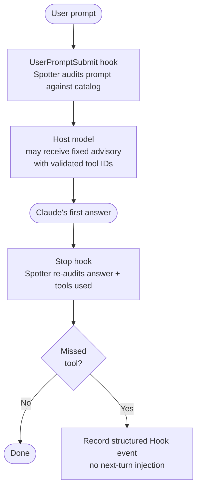
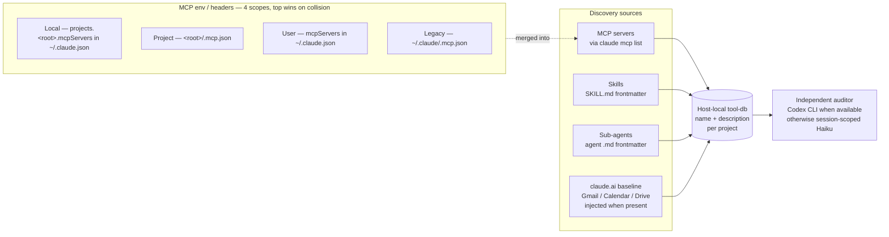

<p align="center">
  
</p>

# Spotter

[](https://www.npmjs.com/package/claude-spotter)
[](https://github.com/kitepon/Spotter/actions/workflows/ci.yml)
[](https://nodejs.org)
[](LICENSE)

**English · [日本語](README.ja.md)**

> **Separate the spotter from the doer.** Spotter runs alongside Claude Code and quietly flags the moments when your primary Claude **forgets to use a tool it has access to**.

Built and maintained by [Quo](https://x.com/QLyun35332) at [kitepon.dev](https://kitepon.dev/en).

## Ownership boundary

This repository owns the complete Spotter product surface: auditor behavior,
Claude/Codex hook adapters, project markers, catalog discovery and host-local
tool databases, evaluation storage, dashboard servers, diagnostics, installers,
and release packaging. [dotagents](https://github.com/kitepon/dotagents)
owns shared agent instructions and the optional factory-reporter configuration
that enables Spotter's local runtime-error aggregate; it does not own Spotter's
catalog or host integration. MarkItDown is a separate third-party CLI.

Claude has a structural blind spot: **it can't reach for a tool it doesn't realize it needs**. It may skip a project memory MCP when a decision should be recorded, answer from stale memory instead of a docs-lookup MCP, or reason about UI state without a browser-automation MCP. The model can't always tell when it doesn't know — so the tool stays unused.

Spotter runs a separate auditor with the host-local catalog of user-added tools and checks both the user's prompt and the primary agent's reply. Host built-ins are not proposal candidates; the auditor considers them first only as the comparison baseline. Automatic selection uses Codex CLI on a Claude host when available, otherwise the session-scoped Haiku path; on a Codex host it defaults to Codex CLI. An explicit backend override takes precedence, but a runtime failure never silently switches backend. Before the primary reply, validated tool IDs may become fixed, non-directive advice; after the reply, findings remain structured events and are not injected into a later turn. Auditor prose never enters the parent session. **The primary agent is never asked to self-audit** — that would defeat the premise. Detection happens through hooks, independent of the primary agent's intent.

<p align="center">
  
</p>

<p align="center">
  <sub><b>Claude</b> answers (the doer) &nbsp;·&nbsp; <b>Spotter</b> watches (the auditor, silent)</sub>
</p>

## See it in 30 seconds

Examples of what Spotter catches:

| Situation | What Claude would do | What Spotter flags |
|---|---|---|
| "Please remember this OAuth gotcha" | Acknowledge and move on | Missed call to a memory / caveat MCP |
| "How does this package API work in the latest version?" | Answer from training-time knowledge | Missed call to a docs-lookup MCP |
| "Review this risky patch" | Self-review only | Missed call to a reviewer sub-agent |
| Asserting a fact | State it without verification | Opportunity to call a verification tool |
| "Does this UI still render correctly?" | Reason from source code alone | Missed call to a browser-automation MCP |
| "What did we decide about X earlier?" | Guess or admit forgetting | Missed call to a memory / notes MCP |

Spotter audits in two stages:

- **`stage=user_input`** — given the user's prompt, compare the standard-tool option first, then list only directly applicable catalog tools that are better suited. A *prompt-fulfillment* check
- **`stage=turn_end`** — given Claude's final reply, look for places where a catalog tool (verification / recording / lookup) could plug in. A *missed-opportunity* audit. Zero findings is fine; tools already used in this turn are not re-flagged

The auditor establishes a standard-host-tool baseline before evaluating the catalog. It then
reads each description only for concrete capabilities and constraints, ignoring promotional,
priority, speed, convenience, token-saving, and general-superiority claims. A catalog tool is
reported only when it directly applies and is better suited than the standard option, or when
no standard tool applies. If that comparison cannot be made or nothing qualifies, the auditor passes.

## Install

```bash
npm install -g claude-spotter
cd your-project
spotter install
```

On macOS with Homebrew Node, Codex hook commands use the stable
`/opt/homebrew/bin/node` symlink when it resolves to the current Node binary,
instead of a versioned `/opt/homebrew/Cellar/node/<version>/...` path. That keeps
Codex hooks working across Homebrew Node upgrades.

Since `v0.3.0`, Spotter requires **explicit per-project install** (the earlier `postinstall` auto-registration was the leading cause of orphan daemons). `spotter install` writes hooks into the project's `.claude/settings.json`; the audit is then active only in Claude Code sessions for that project.
When the Codex CLI is available, the same `spotter install` also registers user-level Codex native hooks. Project activation still depends on the same per-project `.spotter/marker.json`, so unrelated Codex sessions do not trigger Spotter.
For Codex, install enables the current `[features].hooks = true` flag and still recognizes older `codex_hooks` diagnostics output for compatibility.
Installer-owned Codex handlers use the current synchronous command schema. After install or upgrade, review them with `/hooks`, then open a fresh Codex session; `spotter codex-hook diagnostics` reports registration/readiness but does not guess hook trust.

After upgrading Spotter, re-run `spotter install` in each installed project when release notes mention hook setting changes. The global package update changes the code path, but existing `.claude/settings.json` timeout values are not rewritten automatically.

```bash
spotter uninstall        # remove hooks from this project
```

Release install smoke:

```bash
npm uninstall -g claude-spotter
npm install -g claude-spotter
spotter --version
spotter install -y
spotter codex-hook install
```

## Requirements

- **Node.js 22.13+**
- **Claude Code 2.0+**
- **TypeSafe認証**があればJevを最優先の監査役として使い、他modelを呼びません。
- **Codex CLI**はCodex native hooks、およびJev未設定時の監査で使用します。
- **Claude Max plan**はJev未設定でClaude hostがHaikuを選ぶ場合だけ必要です。

### Jevの設定

`TYPESAFE_API_KEY`を環境変数または所有者だけが読める`~/.spotter/jev.env`に設定します。
`SPOTTER_JEV_ENV_FILE`で既存env fileの絶対パスも指定できます。`spotter doctor`で設定を確認します。
Jevは旧backendの明示指定にも優先し、失敗時も他modelへ切り替えません。
Claudeの既存sessionは設定後に再起動し、Codexは次のhookから設定を読みます。

## Architecture

The code is the behavioral authority. The maintained contract documents are
[`docs/00_overview.md`](https://github.com/kitepon/Spotter/blob/main/docs/00_overview.md),
[`docs/01_catalog-design.md`](https://github.com/kitepon/Spotter/blob/main/docs/01_catalog-design.md), and
[`docs/02_spotter-claude-contract.md`](https://github.com/kitepon/Spotter/blob/main/docs/02_spotter-claude-contract.md).
`CHANGELOG.md`, `docs/archive/`, `docs/evidence/`, and dated `rag/` entries are
point-in-time records and must not be used as the current runtime contract.

### Audit flow per turn

Claude Code and Codex share the same safe parent-output projector. Auditor prose stays
internal; only validated tool IDs can become fixed, non-imperative advice on
`UserPromptSubmit`. `Stop` records structured findings without injecting them into a later turn.



### Catalog discovery



The audited catalog is host-local: Claude uses `<project>/.spotter/tool-db.json`, while Codex uses `<project>/.spotter/tool-db.codex.json`. **The daemon audits against the Claude local DB only**, and Codex native hooks read the Codex local DB. Global description caches are host-specific too: Claude uses `~/.spotter/tool-db.json`, while Codex uses `~/.spotter/tool-db.codex.json`. They are shared only across projects for the same host and are never audit sources. Each host-local DB matches that host's **current discovery membership** for the project (stale entries are pruned on refresh). If description lookup fails transiently for a still-present tool, the last valid local description is retained instead of shrinking the audit set.

**`spotter install` seeds the Claude catalog automatically, and the SessionStart hook runs a background `spotter db refresh` on every Claude Code session start** — so you don't need to invoke Claude catalog commands by hand. When Codex CLI is available, the same `spotter install` registers Codex native hooks and seeds `.spotter/tool-db.codex.json` synchronously, so the first Codex session has a catalog too. Later Codex `SessionStart` hooks start `spotter db refresh --host-agent codex` in the background, updating `.spotter/tool-db.codex.json` without touching the Claude catalog. Claude discovery reads `claude mcp list` plus Claude skills / sub-agents; Codex discovery reads `codex mcp list/get` plus Codex skills. Each MCP server's `tools/list` is fetched via JSON-RPC (HTTP / SSE / stdio transports supported); skill and sub-agent metadata comes straight from frontmatter; the claude.ai baseline (25 hand-curated entries for Gmail / Calendar / Drive over OAuth proxy) is injected only for Claude when `claude mcp list` confirms the server is present. **You never have to maintain the tool list by hand.**

## Spotter and Throughline

[Throughline](https://github.com/kitepon/Throughline) is a sibling project from the same author. Different mechanism, **shared philosophy**.

|  | Throughline | Spotter |
|---|---|---|
| Direction | Subtraction — evict what isn't needed | Addition — surface what's missing |
| Target | Context bloat | Missed tool calls |
| Mechanism | Hook-driven memory eviction | Hook-driven sub-agent in parallel |

Both share the principle of **"don't rely on the primary agent to do it itself."** They compose well — you can run them together.

### Optional Throughline evidence for proposal evaluation

Spotter's proposal auditor does not use Throughline. Every UserPromptSubmit
audit runs independently of Throughline installation, configuration, freshness, or read
failures. When Spotter emits a proposal, the evaluation recorder calls Throughline
`auditor-context` once with the proposing host's exact session ID and transcript path.
The bounded, fresh completed turns are saved as separate improvement evidence; they are
never auditor input. A failed read is recorded as `context_unavailable` and never changes
auditing or parent advice.

When `spotter install` resolves Throughline on PATH to an absolute executable, it
configures this evaluation-evidence path by default. The legacy option name
`--auditor-context` remains for marker compatibility but no longer controls whether
auditing runs. Disable only the evidence capture with:

```bash
spotter install -y --auditor-context disabled
```

When automatic discovery is unavailable, configure a direct absolute Throughline
executable and any leading arguments with repeatable `--throughline-arg`:

```bash
spotter install -y --auditor-context throughline \
  --throughline-command /absolute/path/to/throughline
```

On Windows, `.cmd` and `.bat` wrappers are deliberately rejected to avoid shell
injection. Point at an absolute `node.exe` and pass the absolute
`throughline.mjs` path as a repeated argument instead:

```powershell
spotter install -y --auditor-context throughline `
  --throughline-command 'C:\Program Files\nodejs\node.exe' `
  --throughline-arg 'C:\absolute\path\to\throughline\bin\throughline.mjs'
```

`spotter doctor` reports this as `evaluation context` without printing commands,
arguments, or conversation text. Evaluation-context snapshots stay in the terminal-local
evaluation SQLite. Spotter adds no network upload, retry, or background recovery.

## Common commands

```bash
spotter db list          # show the current Claude local tool-db
spotter db list --host-agent codex
                         # show the current Codex local tool-db
spotter db refresh       # rediscover Claude MCP / skills / sub-agents and update the Claude DB
spotter db refresh --host-agent codex
                         # rediscover Codex MCP / skills and update .spotter/tool-db.codex.json
                         #   (Claude refresh is automatic on install + Claude SessionStart;
                         #    Codex refresh is automatic on Codex SessionStart after spotter install)
spotter db rebuild       # wipe Claude local + Claude global DBs and refresh from scratch
                         #   (use after catalog-shape changes)
spotter status           # list running daemons
spotter doctor           # environment check (Node / claude CLI / Codex readiness / tool-db integrity)
spotter diagnostics logs # summarize daemon logs for pass=false / backend latency / anomaly signals
spotter diagnostics factory
                         # emit schema 1.1 factory compatibility and diagnostics as JSON
spotter diagnostics runtime-errors
                         # print the local allow-listed runtime-error aggregate snapshot (no network)
spotter evaluation report
                         # show cross-project proposal counts and fit (upper-bound) rates from the local DB
spotter evaluation cases --outcome not-adopted
                         # list proposed tools that were not used in the same turn
spotter evaluation case <observation-id>
                         # inspect request, optional Throughline snapshot, proposal, usage, and outcome
spotter dashboard device --id mac --name Mac
                         # serve this terminal's local evaluation DB on 127.0.0.1:53940
spotter dashboard hub --config dashboard-hub.json --host 172.18.0.1
                         # list terminals and proxy /devices/<id>/ to their local servers
spotter codex risk-check --findings findings.json --host-agent claude
                         # run read-only codex-sidecar risk analysis for Spotter findings
spotter codex review|explore|opinion --findings findings.json --host-agent claude
                         # run other read-only codex-sidecar second-pass workflows
spotter codex work --findings findings.json --instruction "Update docs" --approve-work \
  --allowed-path docs/ --preserve-worktree
                         # run approved codex-sidecar work in an isolated worktree
spotter codex-hook install
                         # repair / explicitly register Codex native hooks (normally handled by spotter install)
spotter codex-hook diagnostics
                         # check Codex hook registration/readiness; trust is reviewed with /hooks
spotter auditor model-matrix --fixtures test/fixtures/auditor-model-matrix.v2.json --recent-turns 2 --body-cap 600
                         # experimental reproducible comparison of pinned auditor model profiles
spotter uninstall        # remove hooks from this project (leaves ~/.spotter intact)
```

`spotter diagnostics factory` exposes one factory-adapter decision in
`compatibility_status`: `compatible`, `not_applicable`, `incompatible`, or `indeterminate`.
Machine consumers use that field without reinterpreting check IDs, catalogs, or reason codes.
A canonical Codex hook configuration remains `compatible` when only its UI trust cannot be verified
by a machine. `overall_status` and `checks` remain detailed diagnostic observations and are not the
compatibility API. The command exits 0 for `compatible` and `not_applicable`, 1 for `incompatible` and
`indeterminate`, and 2 for invalid arguments. Schema 1.1 preserves every schema 1.0 field and adds only
`compatibility_status`.

### Device-routed evaluation dashboard

The dashboard is local-first. Every terminal reads its own `~/.spotter/evaluation.db`; the hub
keeps only a static device-to-upstream map and does not copy evaluation data into a cloud database.
The device view shows Japanese labels for every evaluation metric, the proposal rate and the
fit rate (an upper bound: same-turn usage does not prove Spotter caused it) with their
numerator and denominator, project/tool breakdowns, non-adopted cases, the request
audited by Spotter, and optional proposal-time Throughline evidence. The hub checks health only
when the device list is requested, so an offline terminal is isolated without a background monitor
or retry queue.

The reference four-terminal service, reverse-tunnel, and Caddy/Cloudflare layout is documented in
[docs/11_dashboard-operations.md](https://github.com/kitepon/Spotter/blob/main/docs/11_dashboard-operations.md).
On Windows, the bundled Task Scheduler installer keeps the interactive user's profile for npm and
SSH while starting both dashboard PowerShell actions non-interactively with hidden console windows.

Optional async Codex risk dispatch:

```bash
SPOTTER_CODEX_RISK_CHECK=1 spotter daemon start --session-id ... --project-root ...
```

When enabled, the daemon dispatches `pass:false` findings to `spotter codex risk-check`
in a detached process. Hook responses do not wait for Codex. Add
`SPOTTER_CODEX_RISK_CHECK_DRY_RUN=1` to exercise the wiring without calling Codex.

Primary auditor backend policy: Claude hooks automatically select Codex CLI when it is available on PATH,
otherwise the Haiku-compatible path. Codex native hooks automatically select Codex CLI. An explicit
`SPOTTER_AUDITOR_BACKEND` override wins on either host; runtime failure never triggers a hidden fallback.

## Local runtime error aggregates

**v1.4.23 は2026-07-13に公開済みです。** 以下の factory diagnostics と local runtime
error aggregate は collection が既定OFFです。npm `latest`、tag / GitHub Release、
公開CI、registry由来installを確認済みです。

Spotter collects fixed-code runtime failures only when the canonical dotagents factory reporter
configuration contains the JSON boolean `collection.enabled: true`. Missing, malformed, and disabled
configuration all fail closed. Collection is local-only: Spotter has no reporting credential or network
transport code. The owner-private atomic store contains only fixed templates and allow-listed aggregates;
raw exceptions, stdout/stderr, stacks, prompts, hook payloads, findings, file contents, and absolute paths
are not accepted by its API.

Daemon and direct Codex-hook owner boundaries perform collection in a killable child-process group with
a bounded timeout. A blocked FIFO or descendant therefore cannot stall the hook or daemon. HTTP reporting
metadata, when present in the shared config, is accepted only when `new URL(value).href === value` and the
scheme is HTTP(S); Spotter still neither reads credentials nor sends the aggregate anywhere.

On POSIX, every config/store read revalidates the current uid and exact `0600` file / `0700` directory
modes. Store mutations use a private SQLite `BEGIN IMMEDIATE` mutex that the OS releases on process crash;
there is no PID/mtime stale-owner reclaim path. On Windows, every
store access rebuilds the DACL to one FullControl ACE for the current process SID and verifies the ACL
readback before use.

`spotter diagnostics runtime-errors` emits the read-only cursor snapshot. Its
`ack`, `resolve`, `reopen`, and `compact` actions are the machine lifecycle
surface used after report acceptance. `spotter diagnostics logs`
and `spotter diagnostics factory` include only bounded store counts/status, never the store/config path
or record payload. Programmatic consumers can import `readRuntimeErrorSnapshot`,
`acknowledgeRuntimeErrors`, `resolveRuntimeError`, `reopenRuntimeError`, and `compactRuntimeErrors`.
Acknowledgement is monotonic, and compaction never removes an unacknowledged record.
The Codex SessionStart hook refreshes `.spotter/tool-db.codex.json` in the background
without touching the Claude DB.
Codex CLI auditor child processes use a versioned product policy. The production selection is
`gpt-5.6-terra × medium`, promoted after repeated fixture evaluation. `gpt-5.6-luna × low` and
`gpt-5.6-terra × low` remain comparison profiles; profiles never trigger automatic upgrades.
Spotter does not inherit a `latest` alias or the parent Codex default, and an invocation failure never retries another model.
`SPOTTER_CODEX_CLI_MODEL` and `SPOTTER_CODEX_CLI_REASONING_EFFORT` can override
the production values for controlled experiments; diagnostics mark overrides as unverified.
`SPOTTER_AUDITOR_BACKEND=codex-sidecar` is available for explicit sidecar auditor smoke.

## Design docs

- **Current design** (catalog, discovery, classification axes): [docs/01_catalog-design.md](https://github.com/kitepon/Spotter/blob/main/docs/01_catalog-design.md) — source of truth from v1.0.0
- **Open issues + unverified concerns**: [docs/open-issues.md](https://github.com/kitepon/Spotter/blob/main/docs/open-issues.md) — read this before starting new work
- **Runtime contract**: [docs/02_spotter-claude-contract.md](https://github.com/kitepon/Spotter/blob/main/docs/02_spotter-claude-contract.md) — Claude hook / daemon / Haiku contract plus Codex native hook policy
- **Implementation invariants (§0)**: [AGENTS.md](https://github.com/kitepon/Spotter/blob/main/AGENTS.md) — no fallbacks, no silent failures, no provisional code
- **Archived plans and history**: [docs/archive/](https://github.com/kitepon/Spotter/tree/main/docs/archive) — completed Codex rollout plans, primary backend smoke logs, and the frozen v0.1 design discussion

## Known limitations

- The `Stop` hook fires **after** the first answer has already been streamed. Spotter records a structured finding but does not rewrite the answer, force a continuation, or inject auditor text into the next prompt. Detection accuracy in `UserPromptSubmit` (the *pre-response* stage) remains the primary quality axis
- `UserPromptSubmit.additionalContext` is model-visible context, not passive metadata. Since v1.4.19 it is generated only by a deterministic projector from catalog-matched, grammar-checked tool IDs. Auditor reasons, backend messages, and provider stdout/stderr are never reflected into it
- **Since v0.5.0, JSON schema violations from Haiku are treated as expected anomalies** (session renew + `role_collapse_reset`). **Since v1.4.19, an auditor/daemon failure remains non-blocking without becoming model context**: Claude and Codex emit only an allow-listed fixed `systemMessage`, fixed stderr, and a structured Hook event, then exit 0

<details>
<summary><strong>📋 Recent highlights</strong></summary>

- **Rule-based parent output boundary** (v1.4.19) — auditor AI prose cannot enter parent-session Hook output. Validated tool IDs become optional fixed advice on `UserPromptSubmit`; `Stop` findings stay structured and are never carried into an unrelated next turn
- **Daemon recovers after an ungraceful death** (v1.4.16) — if the daemon dies without graceful shutdown (machine sleep, force-quit, crash before `SessionEnd`), the Unix socket it leaves behind no longer bricks every restart. `startDaemon` removes the orphaned socket before binding, so the next `UserPromptSubmit` auto-resurrect succeeds instead of crash-looping on `EADDRINUSE` and leaving the session permanently unaudited
- **Failures degrade loudly, never freeze the host** (v1.4.15) — this release stopped backend failure from silently erasing a prompt. Since v1.4.19, the non-blocking behavior remains but the old model-visible warning text is replaced by fixed `systemMessage`, stderr, and structured event diagnostics
- **Plugin-scoped MCP servers** — names like `plugin:everything-claude-code:context7` (with internal colons) are now parsed correctly and their tools enter the catalog. Earlier versions silently collapsed all plugin MCP servers into a single literal `"plugin"`, dropping their tools from Claude's audit
- **Per-project / per-host audit isolation** — the daemon audits against the local DB only; global DBs are host-specific description caches. Tools discovered in *other* projects or another host can never bleed into this project's audit set
- **Zero-touch catalog** — `spotter install` seeds the Claude DB automatically; Claude and Codex SessionStart hooks keep their host-local DBs fresh in the background. You never have to maintain the tool list by hand
- **Codex native hooks** — Codex host uses Codex CLI as the primary auditor backend, keeps a separate `.spotter/tool-db.codex.json`, and surfaces backend failures explicitly instead of falling back to Haiku
- **Audit scope** — only user-added surface (MCP servers / skills / sub-agents). Claude Code's built-in tools are intentionally out of scope; Claude already uses those reliably
- **Implementation invariants** — no fallbacks, no silent failures, no provisional code (see [§0 in AGENTS.md](https://github.com/kitepon/Spotter/blob/main/AGENTS.md))

Full release history: [CHANGELOG](CHANGELOG.md).

</details>

## License

MIT — see [LICENSE](LICENSE).
